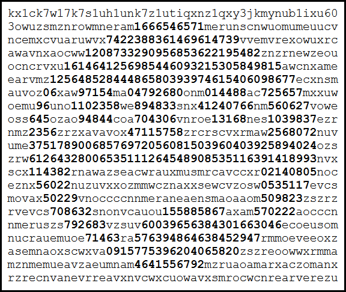

\[Click on image to start a DOSBox in your browser containing [smile.com](smile.com)\]  
[](https://xyzzy.github.io/smile-media/)

# Smile

When ASCII art is the executable

### Welcome to the Wonderful World of ASCII executables

*The marvelous wonders of self modifying code*

"Smile" is an executable ASCII and consists exclusively of digits and lowercase letters.

  - Viewed as text, it shows ascii art consisting of digits and the ascendless lowercase letter "acemnorsuvwxz".  
    The difference in contrast between the height of letters and digits should highlight the embedded artwork.

  - Running as a MS-DOS/FreeDOS executable, it displays a kaleidoscope.

Reducing the instruction set by removing all opcodes that are not alphanumerical, strips it basically down to only four types instructions.  
Two of those four are by an astronomical improbability capable to jailbreak those restrictions.

The code and analysis might look straight forward but bear in mind that more than 800 tries and attempts were made to find the magic combination of instructions.

`TL;DR` The juicy technical bit is about the mother of all instructions (stage1), and the radix13 encoding using ascii art (stage2).

"Smile" is re-mastered from the original 2011 version.

## Table of contents

  - [Welcome to the Wonderful World of ASCII executables](#welcome-to-the-wonderful-world-of-ascii-executables)
  - [Table of contents](#table-of-contents)
  - [Challenges/restrictions and bonuses](#challengesrestrictions-and-bonuses)
  - [Usage](#usage)
    - [Instruction set analysis](#instruction-set-analysis)
      - [Registers](#registers)
      - [Instructions that write/modify `%si`](#instructions-that-writemodify-si)
      - [Instructions that write/modify `%di`](#instructions-that-writemodify-di)
      - [Instructions that write/modify `%bp`](#instructions-that-writemodify-bp)
      - [Instructions that modify `%bx`](#instructions-that-modify-bx)
      - [Instructions that can be used before an anchor register is loaded](#instructions-that-can-be-used-before-an-anchor-register-is-loaded)
  - [Implementation](#implementation)
    - [Stage 1](#stage-1)
      - [Program start](#program-start)
      - [Number generator](#number-generator)
      - [Re-mastering bonus](#re-mastering-bonus)
    - [Stage 2](#stage-2)
    - [Stage 3](#stage-3)
      - [Radix13 encoding](#radix13-encoding)
  - [Manifest](#manifest)
  - [Building](#building)
  - [Versioning](#versioning)
  - [License](#license)
  - [Acknowledgments](#acknowledgments)
  
## Challenges/restrictions and bonuses

*Mastery is revealed in limitation \[Goethe\]*

Computer code consists of bytes where most of the common used values are not displayable as text.  
For "smile" only 10+26 of those byte characters are usable reducing their usability down to 15%.  
The ASCII art avoids an additional 13 letters reduces that further down to 9%.

Removing instructions that are not alpha-numerical, strips functionality down to the fundamental/conceptual minimum:

  - 4.5 of the 7 registers available.
  - 4 of the ~80 instructions available.
  - constant values start from 48, (only range 0x30-0x39,0x61-0x79).
  - contents of three registers: %bx (where memory starts), %si (where program starts), %di, which are safe to access.
  - only the values `%bx=0x0000`, `%si=0x0100`, `%di=0xfffe`, `(%bx)=0x20cd`  are available.

In all practicality, only the `XOR` and `IMUL` instructions are usable.  
The destination of the `XOR` is updated whereas the destination of the `IMUL` is overwritten.  
Reading undefined memory (other than location 0 or program code) is considered an error.

The chances that what is left can produce an working executable that can jailbreak is so
 astronomically small that the only explanation would be that the opcodes of the x86 instruction-set
 were deliberately constructed with ascii-safe executables in mind.

"Smile" does take advantage of a DOS environment:

  - DOS `.com` programs do not require a binary header.  
    The contents of a `.com` are loaded verbatim at address `0x0100` and run unconditionally.

  - Self-modifying code.  
    DOS does not enforce memory protection allowing the mixing of code and data.

## Usage

Within a DOS environment and command prompt:

  - View as text:

	TYPE smile.com

  - Run as executable:

	smile

## Instruction set analysis

The file [instructions.txt](instructions.txt) contains an overview of all usable ascii-safe instructions.

In essence only the registers `%si`, `%di`, `%bp`, `%bx`, `%ah` are available, and the instruction classes:

```assembly
	xor	reg,OFS(reg,reg)
	xor	OFS(reg,reg),reg
	cmp	reg,OFS(reg,reg)
	imul	$IMM,(reg,reg),reg
	jXX	OFS
```

Each instruction class has a limited combination of registers and offsets.  
Offsets and immediate values need to be ascii-safe.  
Some instructions allow the omission of a register offset.


The `imul` instruction writes to a register, and the `xor` does a read-modify-write to either a register or memory.

Both `imul` and `xor` are also the critical minimal to write a hash/number generator and self-modifying code.  
Without these two classes of instructions this project would not have been possible.

### Registers
There are four and a half registers available:

- Two 16bit index registers (ireg) `%si` and `%di`
- Two 16bit base registers (breg) `%bp` and `%bx`
- One 8bit register `%ah`

### Instructions that write/modify `%si`

Initial value of `%si` is `0x0100`

`%si` is highly versatile.  
`%si` is volatile because it is the only register that can be used for the number generator  

```assembly
	xor	(breg,ireg),%si
	xor	(%si),%si
	xor	(%di),%si
	xor	(%bx),%si
	xor	OFS(breg,ireg),%si
	xor	OFS(reg),%si
	imul	$IMM,(breg,ireg),%si
	imul	$IMM,(%si),%si
	imul	$IMM,(%di),%si
	imul	$IMM,(%bx),%si
	imul	$IMM,OFS(breg,ireg),%si
	imul	$IMM,OFS(reg),%si
	imul	$IMM,(breg,ireg),%si
	imul	$IMM,(%si),%si
	imul	$IMM,(%di),%si
	imul	$IMM,(%bx),%si
	imul	$IMM,OFS(breg,ireg),%si
	imul	$IMM,OFS(reg),%si
```

### Instructions that write/modify `%di`

Initial value of `%di` is `0xfffe`

`%si` is needed to modify `%di`.

```assembly
	xor	(%bx,ireg),%di
	xor	OFS(%bx,ireg),%di
	xor	OFS(%bp,%si),%di
	imul	$IMM,(%bx,ireg),%di
	imul	$IMM,OFS(%bx,%ireg),%di
	imul	$IMM,OFS(%bp,%si),%di
```

### Instructions that write/modify `%bp`

Initial value of `%bp` is undefined.

Only way to write to `%bp` is by using `imul`.
The `imul` requires an ascii-safe register offset, requiring a preloaded anchor register.

```assembly
	xor	OFS(breg,ireg),%bp      
	xor	OFS(reg),%bp	  
	imul	$IMM,OFS(breg,ireg),%bp 
	imul	$IMM,OFS(reg),%bp     
	imul	$IMM,OFS(breg,ireg),%bp 
	imul	$IMM,OFS(reg),%bp     
```

### Instructions that modify `%bx`

Initial value of `%bx` is 0x0000.

Only the high byte can be modified.  
`%bx` only use is for the number generator described below.

```assembly
	xor	(%bx,ireg),%bh
	xor	OFS(%bx,ireg),%bh
	xor	OFS(%bp,%si),%bh
```

### Instructions that can be used before an anchor register is loaded

The anchor register can be used with ascii-safe offsets to patch stage2.  
Excluding instructions that use the undefined `%bh` and `%bp`

```assembly
	xor	%si,(%bx,ireg)
	xor	%si,(%si)
	xor	%si,(%di)
	xor	%si,(%bx)
	xor	%di,(%bx,ireg)
	
	xor	(%bx,ireg),%si
	xor	(%si),%si
	xor	(%di),%si
	xor	(%bx),%si
	xor	(%bx,ireg),%di
	
	imul	$IMM,(%bx,ireg),%si
	imul	$IMM,(%si),%si
	imul	$IMM,(%di),%si
	imul	$IMM,(%bx),%si
	imul	$IMM,(%bx,ireg),%di
```

## Implementation

"Smile" is a three-stage loader/executable.  
The multi-stage design is to escape the limitations of a more than critical reduced instruction-set.

  - Stage-3: The actual program.  
    It is encoded as ascii-safe string and unpacked by stage 2

  - Stage-2: The unpacker.  
    Optimised loader thats converts the radix13 encoded ascii art converter to
    The ascii-safe instruction-set is incomplete to do anything really useful.  
    Unsafe bytes are made safe replacing them with a placeholder value that need to patched before the code can be executed.

  - Stage-1: The patcher.  
    A gem of improbability jumping through hoops to patch/self-modify stage-2 into something runnable.

In effect, stage1 prepares the input and output pointers, stage2 unpacks the most efficient decoder and stage3 is the demo.

### Stage 1

The function of stage-1 is to patch some code bytes of stage-2.

The simplest way to patch stage-2 is `XOR`ing the ascii-safe placeholders with a precalculated value that changes it into the required opcode.  
Something like `xor $IMM,ADDR`, but that instruction is unavailable.  
Not only that, the concept of using constants for `IMM` and `ADDR` is also unavailable.
The only way to access memory is by using register indirect with optional offset: `OFS(reg)`.  
For multiple patches, loading the register with individual addresses is expensive.  
We would want to have some central reference and use `OFS` to actual patch locations

`OFS`, when used, needs to be ascii-safe and with a large enough range to span stage2.  
`reg` needs to be loaded with the address of the reference point.

To ease on readability, offsets have been chosen to be ascii-lowercase values.  
In case of emergency, there is a second range having ascii-digit values

Until the reference register has been loaded, offsets are unavailable reducing the available instructions:

```assembly
	// `ireg` is either %si or %di
	// `reg` is either %si, %di or %bx
        
	xor	%si,(reg)
	xor	ireg,(%bx,ireg)
	xor	(reg),%si
	xor	(%bx,ireg),ireg
       
	imul	$IMM,(reg),%si
	imul	$IMM,(%bx,ireg),ireg
```

`reg`, can be one of `%si`, `%di`, `%bx`.  
  `%bx` is in-use and unavailable  
  `%si` holds the generated number and unavailable.  
  `%di` free and only candidate for reference register.

#### Program start

The above base instructions all use input values from either memory or registers.  
They do not provide fixed values, they read and modify values.  
Using them only makes sense when the input values are defined.

DOS initializes the following environment with fixed values:

```assembly
	%si = 0x0100  
	%di = 0xfffe  
	%bx = 0x0000  
	(%bx) = 0x20cd 
```

Applying these as constraints to the set of base instructions above, reduces it further to:

```assembly
	xor	%si,(%bx)
	xor	(%bx),%si
	imul	$IMM,(%bx),%si
```

These are the only three instructions available until `%si` or `%di` contains a reference location.

#### Number generator

Having `imul` and `xor` are perfect ingredients for a hash-function/number-generator.

The `imul` creates a new value based on a stored hash and given seed, and writes that to `%si`.  
A second step for continuation used the `xor` to update the hash value.

```assembly
	imul    $SOMESEED,(%bx),%si	// next number in register
        xor	%si,(%bx)		// next number in memory
```

The idea is to craft a sequence of specific seed/multipliers that create the necessary values to patch stage 2.

```assembly
	// generate number
	imul	$SOMESEED,(%bx),%si
	xor	%si,(%bx)

	// with %si as temporary reference register, load %di
	imul	$SOMESEED,OFS(%bx,%si),%di

	REPEAT {
		// generate number
		imul	$SOMESEED,(%bx),%si
		xor	%si,(%bx)

		// patch memory
		xor	%si,OFS(%di)
	}
```

`smile` uses three number generators.

The stage 1 generator is to patch stage 2, called `HASH` and located at `(%bx)`.

The stage 2 generator is to unpack stage 3, called `HEAD` and located at `OFSHEAD(%bx,%di)`.

The third generator is to feed entropy into `HEAD`, and is located as it passed through the input text.

#### Re-mastering bonus

After writing the above section and re-mastering the sources:

New insights made it possible to reduce the size of stage1 to under 48 bytes.  
This makes extra instruction available that allow the loading of %di as first step.  
Effectively halving the size of stage1.

### Stage 2

With the added functionality of reading/writing a stream of data.
The input stream is limited range text and influences the number generator
The output stream are binary snapshots of the number generator.  
The encoder creates text that requires the least number of generator cycles.

Task is to load stage 3, an arithmetic based radix13 character encoding.  
Stage 3 will load the actual demo.  
For really large demos, there is also an additional zip-based loader.

In the text/input-data there are also encoded two commands:

- Increment position of the output head, which contains the number generator hash.
  Setting the highest bit in the hash value, it should be clear otherwise.

- End of sequence.
  Setting the upper byte of the hash to zero, it should be non-zero otherwise.

Side by side comparison to the stage2 decoder with left the reduced instruction set and right a "C" like equivalent.
The block comments are written towards the instructions, the inline comments towards the language code.

Stage2 has two number generators.
The main generator is to generate selected numbers that creates outputs bytes.  
The head of the output holds the generator hash, its position increments when desired numbers have been reached.  
Entropy is injected into the generator to steer the outcome efficiently.  
The more efficient, the shorter the encoded stream.  
Injection data is the encoded text.  
The limited range of the input bytes limits the effect of the entropy.
To increase the dynamic, a second number generator is used fed by the input text.  
The secondary, full-word value is used to feed the main generator.

This approach allows an average of 2.6 radix13 characters to produce a single byte value.  
56 bytes of code require 146 characters of storage.

data/code will be unpacked directly after stage2.
When decoding has completed, the looping "jne" instruction will step directly into stage3 like it was normal program flow.

```assembly
	/*
	 * step-1: generate number
	 *
	 * Update hash at head of extracted data
	 */

	imul	$SEED,HEAD(%bx,%di),%si		 //* update hash	  **/	WORD si = (SEED * *pHash) & 0xffff;   
   	xorw	%si,HEAD(%bx,%di)		 //* number generator     **/	*pHash ^= si;
   	
	/*
	 * step-2: output byte
	 *
	 * If high bit of hash is set then the low byte is the next byte.
	 * Increment %bx to shift the hash one byte leaving the desired output byte behind
	 * 
	 * Trick by using a byte instead of word increment is that the hash will inherit half the run-time
	 * information. This inheritance influences the outcome of the generator that can (with a 
	 * carefully chosen multiplier) attain the next output value in a single cycle. The encoder can use
	 * this knowledge to craft a lookahead, finding the shortest path to a specific state. 
	 */
	 
	jns	L2				//* is it cmd:byteReady   **/	if (*pHash & BYTEREADY)
	inc	%bx				//* shift output position **/		outPtr++;

	/*
	 * step-3: load next input byte
	 *
	 * Load next byte from input by incrementing %di, decrement %di to keep the output position
	 * Inject the loaded byte into the low-byte of the hash for maximum effect.
	 * Injecting into the low-byte has an undesired side-effect for step-4, so inject into the high-byte.
	 * Injection is a memory-memory operation, use %ah as intermediate byte. %ax is initially 0x0000.
	 */
L2:
	xorb	HEAD(%di),%ah			//* load next input byte  **/	BYTE ah = *inPtr;
	inc	%di				//* shift input position  **/	inPtr++;
	dec	%bx				//* relative / absolute   **/    
	xorb	%ah,HEAD+1(%bx,%di)		//* inject into generator **/	*pHash ^= ah << 8;

	/*
	 * step-4: loop until finished
	 *
	 * Injecting where the result is zero can be used as trigger to indicate end-of-sequence.
	 * This however should not happen for the low-byte because emitting a zero is a valid situation.
	 */
	 
	jne	stage2start		  //* repeat until end-of-sequence */	} UNTIL ((*pHash & 0xff00) == 0);
```

Loading and using a second register would increase the code size by some 30%.  
An alternative approach is to use a single pointer register and use a preloaded second for the relative distance.  
The register `%bx` has been inherited from stage 1, and it is initialised with the value zero.

There is a race condition at the very start.  
The input and output share the same location.  
Updating the generator hash would immediately corrupt the first two input characters.  
To avoid this situation, the next input byte should be located in front of the hash.

Stage2 needs to be able to access the heads of output and input which are located directly after stage2.

#### Stage 3

Stage-2 mainloop is a streaming radix converter.  
Digits are considered radix10, lowercase is considered radix13.  
Output is radix256.

```C
	// load next character from text data and increment
	WORD ax = *inPtr++;

	// test for alpha or numeric
	if (isDigit(ax))
		dx *= 10;	// grow pool for radix10
	else if (isAlpha(ax))
		dx *= 13;	// grow pool for radix13
	else
		continue;	// no, next character    

	// inject input value into pool
	dx += ax;

	// test if byte present
	if (dx & 0xff00) {
		// test for end-of-sequence     
		if (dx == 999)
			break; // found     

		// save byte and increment position
		*outPtr++ = dx & 0xff;

		// extract byte from pool
		dx >>= 8;  
	}
```

#### Radix13 encoding

/our alphabet is beautiful/

The ascii art visuals require ascendless lowercase letters, "acemnorsuvwxz".
For the numerology, they represent the 13 values ranging from 0 to 12.  
A linear conversion from ascii to value is not available.  
A table lookup would be second choice.  
A 26 entry table is depreciated due to their memory footprint.

Time for analysis:

There are 26 lowercase letters.  
13 (exactly half) are desired to be used in text.  
Intuitively, the core of conversion routine would exploit halving the asci value.  
Displaying them in a 2x13 array and striking out the undesired:

```
ace***mo*suw*
******n*r*vxz
```

The top row holds the odd ascii values, the bottom row holds the even.  
If each column is able to hold a single character, it would be an ideal situation.
If the bottom row were to rotate they might "sync" making conversion a linear function.

Rotating the bottom row to the left 7 places:

```
ace***mo*suw*
*r*vxz******n
```

That is a near perfect fit. The only letter standing out is "r".
Also, the "n" jumps location which complicates the code.

Shifting top row to the right 1, and bottom row to the left 6 places:

```
*ace***mo*suw
n*r*vxz******
         ^-----NOTE
```

There is an unused column, and by cosmic coincidence, it has the same position as the clashing "r" above.

Excluding the "r", shift the top row 1 to the right, and the bottom row 6 to the left.

```
*ace***mo*suw
n***vxz**r***
```

Perfect situation, as each column has a single character it is now easy to determine the ordinal value.  
However, all the ascii values are mixed making the ordinal value non-sensible.  
This is solved by the encoder transforming the letters values to match their location after being shifted.

The encoder maps values to letters using this table:

| value | character |
|:----:|:----:|
|  0 | n |
|  1 | a |
|  2 | c |
|  3 | e |
|  4 | v |
|  5 | x |
|  6 | z |
|  7 | m |
|  8 | o |
|  9 | r |
| 10 | s |
| 11 | u |
| 12 | w |

The decoder converts the letter to number using this code:

```assembly
	sub	$'a',%al	// convert letter to ordinal number
	sub	$2,%al		// shift top/bottom row to the right 1 position
	shr	%al		// determine row/column
	jnc	done		// jump if even
	cmp	$9,%al		// what about "r"?
	je	done		// jump if "r"
	sub	$7,%al		// shift "vxz"
```

The first two instructions can be optimised in different ways.

## Manifest

  - [instructions.txt](instructions.txt)  
    Available ascii-safe instructions.

  - [Makefile.am](Makefile.am)  
    Contains descriptions of the build/construction process.

  - [genTemplate.js](genTemplate.js)  
    Helper to convert monochrome png into template text.

  - [template.txt](template.txt)  
    Ascii art template.

  - [stage12.S](stage12.S)  
    Stage1 (patcher) and stage2 (pre-loader) sources.

  - [stage3.S](stage3.S)  
    Stage3 (loader) source.

  - [stage4.c](stage4.c)  
    Stage4 (demo) source.

  - [genStage1.js](genStage1.js)  
    Generate fixups for stage1.

  - [genStage2.js](genStage2.js)  
    Encode stage3 (loader) as mixed radix10/radix13 text.

  - [genStage3.js](genStage3.js)  
    Encode stage4 (demo) as mixed radix10/radix13 text.

  - `token.S`  
    Token based compression decoder.

  - `genToken.js`  
    Token based compression encoder emitting radix10/radix13 text.

  - [LISTING.txt](LISTING.txt)  
    Conceptual listing of the stages together.

  - `Makefile.config`  
    Used for inter-program communication sharing generator details.  
    Included is the version specific to the bundles `smile.com`.

  - [smile.com](smile.com)  
    All the effort dedicated to this.

## Building

No need for autotools when building, `Makefile.am` is a regular makefile.  
Invoke with `make -f Makefile.am smile.com`.

Autotools is used for its maintainer and distribution benefits.

If you like to build with autotools:

```
        ./autogen.sh    # optionally if autotools are not setup
        ./configure     # simple configure
        make smile.com  # 😊
```

Important: re-run make until nothing changes

The project consists of multiple stage generators/encoders and loaders/decoders.
The generators encoded the next stage into text, including decoding instructions (as macros) for the loaders.  
Generators may change `Makefile.config` when replacing macro placeholders with actual values.  
Changes should trigger makefile reloading which restart construction.

## Versioning

We use [SemVer](http://semver.org/) for versioning. For the versions available, see the [tags on this repository](https://github.com/xyzzy/smile/tags).

## License

This project is licensed under GPLv3 - see the [LICENSE.txt](LICENSE.txt) file for details.

## Acknowledgments

* The designers behind the x86 instruction-set for choosing the opcode values for the instructions. 
* [DOSBox](https://www.dosbox.com) for making it possible to run `smile`.
* [JS-DOS](https://js-dos.com) for making it possible to run DOSBox in a browser.
